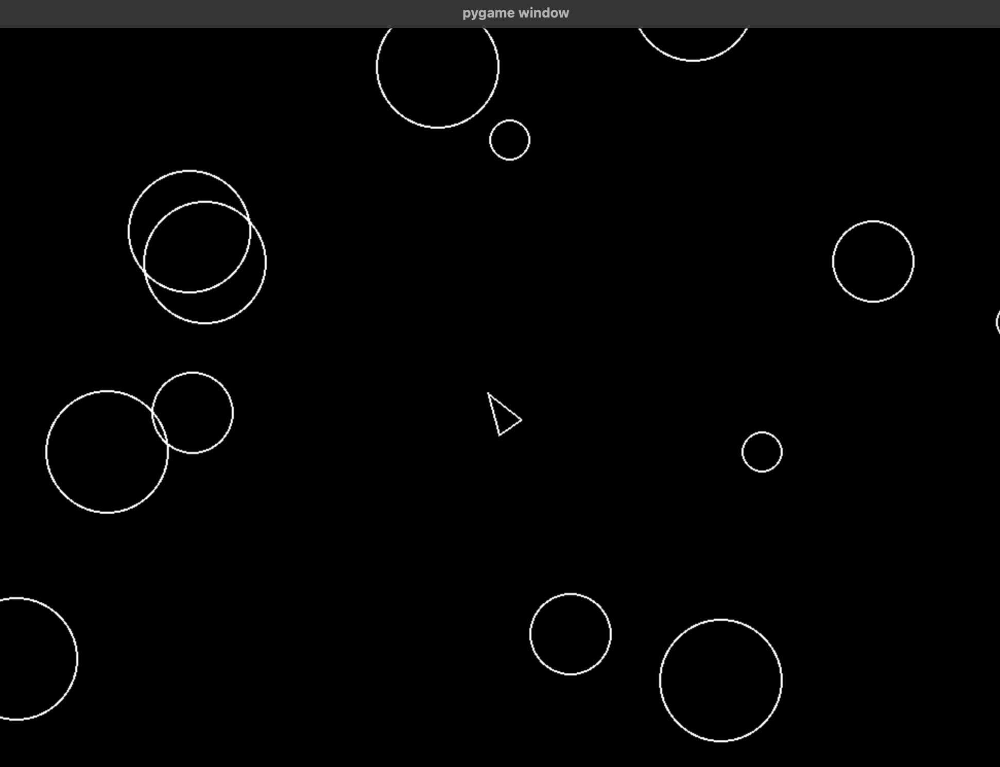

# Asteroids

Python "Asteroids" project to practice Python language basics and object-oriented coding.
Created following [boot.dev](https://www.boot.dev/tracks/backend), built on [pygame](https://www.pygame.org/wiki/GettingStarted).

## Requirements
  . Python3
  . pygame==2.6.1

## Run
`$ Python3 main.py`

## Controls
 . `WASD` - Movement
 . `Spacebar` - Fire blaster

